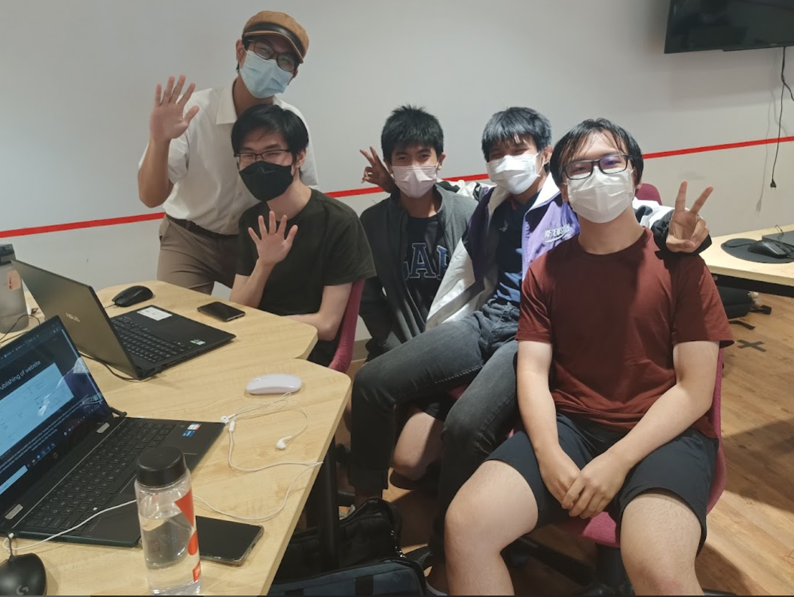

+++
title = "Ecoplus I: Introduction and Ideation"
date = 2021-10-29
+++

This semester, year 2.2, Information Technology and Financial Informatics students take the Portfolio Development module.
We are to select a challenge statement from a list of eight, and create a solution for it.

"Protect the Earth" is the one I chose as it resonates with me and I feel that it is important to protect this planet we live on.
This is also one of the more flexible challenge statements so we can think up lots of ideas.

As technology advances, climate change becomes more severe, leading to rising sea levels and the extinction of plants and animals.
We need to conserve our natural resources and ensure a clean environment to live in.
Where does technology come into the picture? It can be used to spread awareness of this problem and educate people on the importance of protecting our Earth, among other methods.

In the first week, we created a team and brainstormed some ideas.
Quite a number of students from my class chose this challenge statement too.
I was lucky to team up with some of them, two of whom (Kah Seng and Wai Keat) I have worked with before.
I looked forward to working with the other two (Wei Chong and Aung) as I have never worked with them before.

### The team
- Kah Seng (Scrum master)\
Organised guy who tries really hard

- Wai Keat (Developer)\
Happy and helpful, likes music

- Aung (Developer)\
Easygoing, likes to meme and joke around

- Wei Chong (Developer)\
Smart guy, math genius

- Xavier (me, Developer)\
Chill, likes coding

Left to right: Wai Keat, Kah Seng, Xavier (me), Aung, Wei Chong

### Ideation
What's something that's highly accessible?\
That's right, a website.
We thought a website would be easy for people to access since they can use it from a browser on their smartphones or computers.\

The website connects volunteers to events like cleaning up beaches and educates them on the effects of climate change and some solutions to mitigate these effects.
Users can join and create communities and events on the website.\

Kah Seng suggested using Google’s model viewer for Augmented Reality to make our website unique and more interactive.
I suggested a plant game to attract users and give them an incentive to come back to the website in the future.
We won't be creating the plant game yet as it is something nice to have but not necessary.

We had a discussion for the technologies we would be using.
I suggested using {{ link(link="https://www.supabase.io", title="Supabase") }} as our Backend as a Service (BaaS) for storage, database management and authentication, and {{ link(link="https://www.netlify.com", title="Netlify") }} for our web hosting solution which has easy-to-use serverless functions.
Kah Seng suggested using {{ link(link="https://tailwindcss.com/", title="TailwindCSS") }} for our front-end as it's modular and flexible compared to Bootstrap.
He also suggested using Firestore as our database instead of Supabase but I felt that using an SQL database would be better for this project than a NoSQL one.

### Going deeper
It is now the second week. Having thought of some ideas for the website, we started working on a prototype on Figma.
It had the following pages: Home, Community, Volunteering, View Volunteers, Education, and Account.
After this, we decided who would work on each feature.
I chose to work on the database and web hosting since I suggested the technologies for those and am the most familiar with them.

So far, it's going great, but what about our project's name?
We spent a good 1.5 hours deciding on it.
We used a name generator, {{ link(link="https://namelix.com/", title="namelix") }} to aid our brainstorming.
Some of us saw the name "Seed Seed" and really liked it, but some were strongly opposed to this (ahem, Kah Seng).
We came across other catchy names and went through multiple rounds of voting.
It was tough to settle on a name when some members like it and others don't.
We brainstormed a lil longer and came up with "Ecoplus", inspired by C++.

We continued working on the prototype and shared our progress and ideas with Mr Peter Hung, the lecturer involved in this challenge statement, who gave us the green light.
Kah Seng taught us how to use TailwindCSS and proposed a directory structure I opposed.
I didn't like it because the built CSS files were going into the "build" directory when it shuold be the "public" directory.
I explained that the "public" directory should contain files that will be displayed to the public.
Some of these include HTML, CSS and JavaScript files.
TailwindCSS builds a CSS file and generates another CSS file that's to be linked to by the HTML pages.
That's why it didn't make sense to me and I explained my point of view, after which we came to an agreement.
I then set up the Github repository with a base directory structure so that our code is organized.

Later in the day, I taught a few of my teammates how to use Git branches.
What I thought would only take 10-15 mins, ended up being 1.5 hours...
We ran into so many problems, and switching from the HTTPS protocol to SSH finally solved them.
